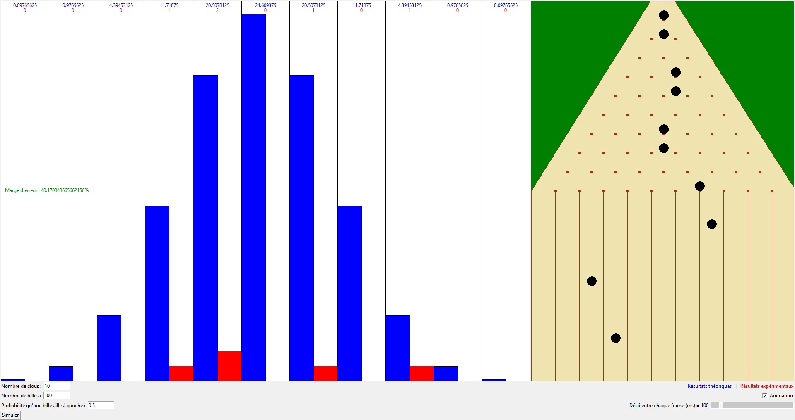

# Python-Galton-Board

This is a simulation of the Galton board.
## Features
- Histogram of theoretical and experimental results
- Visual animation of the simulation
- Margin of error calculation
- Possibility to set the board settings
## Installation
1. Download the repository by clicking on `Code > Download ZIP`
2. Extract the ZIP file
3. Run `main.pyw`
## Requirements
- Python 3.7
- Python `tkinter` library
- Python `random` library
- Python `math` library
- Python `scipy` library